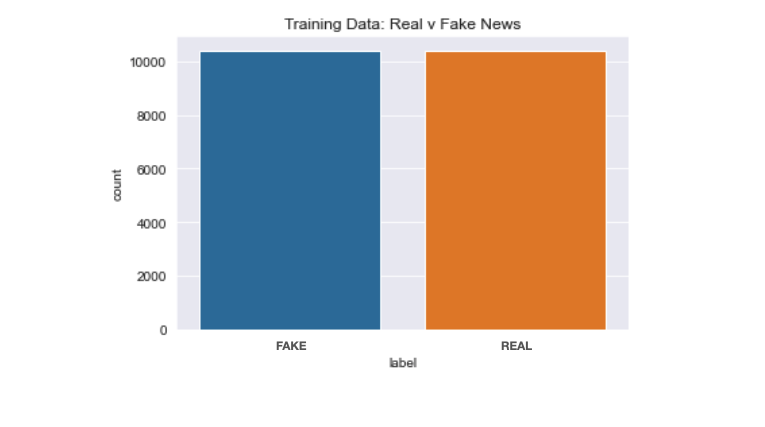
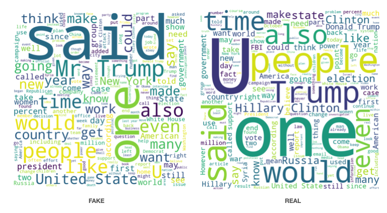
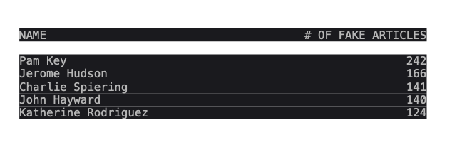
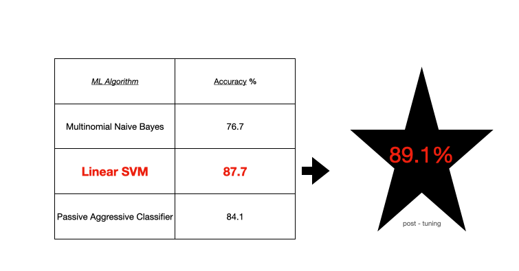
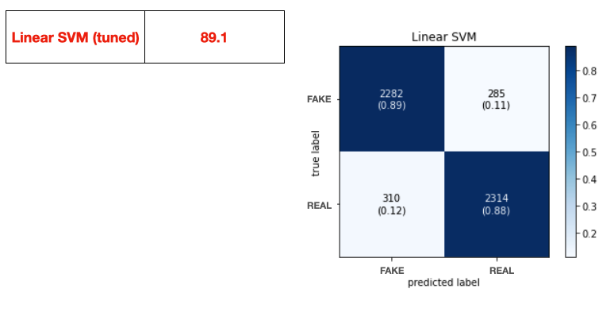
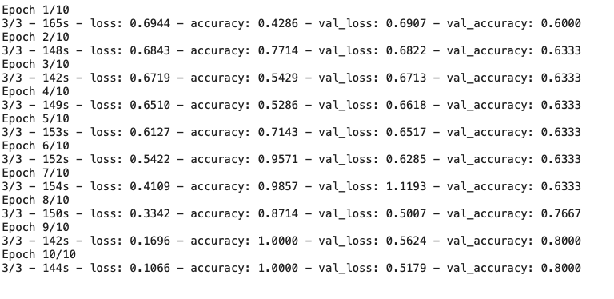

# OVERVIEW / MOTIVATION #

"Fake News" has been a hot topic since the 2016 Elections.

Currently, the spread and propogation of mis- and disinformation focus mainly on health-related issues, where the risks are both more immediate and likly more severe than their politically-fuelled counterparts. 

I set out to find the creators of misinformation, understand the motivations, and ideally, find a reliable way to identify it. 

# The Data Set(s) #

Initially this project used a corpus of approx 26000 news articles with an even distrubtions of "real" and "fake" articles pulled from kaggle.

A word cloud for "real" and "fake" articles allows us to quickly get a gist of the corpus: highly political.

Finding the <mark>value_counts()</mark> of the "fake" offenders and sorting them provides a list of our key culprits in this dataset:

Coincidentally, all work for the same publication: Breitbart.

# Machine Learning Application #

The initial approach was to use bag-of-words and TF-IDF for detection of misinformation. Theses approaches rely on counting a word's frequencies but lack any sort of contect. Naively, I suspected that articles spreading misinformation might be poorly written, use hyperbolic language -- in short, they would be fairly easy to spot. 

Three machine learning algorithms (Naive Bayes, Linear SVM, and Passive Aggressive Classifer) were applied to the corpus of articles and tuned with some nice-looking results:

Unfortunately, the tuned model does NOT perform reliably on unseen data. This suggests two things: probable overtraining, and a poor dataset at best.

With that in mind, I set out to find a better dataset and use more sophisiticated techniques for detection.

# LSTM #

Using TensorFlow I was able to stand up a basic long short-term memory network. Along with technical issues with my own machine, the computing power needed to process the articles within context was staggering compared to bag-of-words and TF-IDF. With this in mind, I used a dataset of ~5000 articles for training and testing. 

Again, great results upon validation but poor performance in the wild.

# Conclusion #

This is a wildly complex problem with many moving parts, many of which aim to actively decieve the consumer. I plan to continue to explore this problem and search for insights to help identify fake news. Until then ... don't believe everything you see online :)

